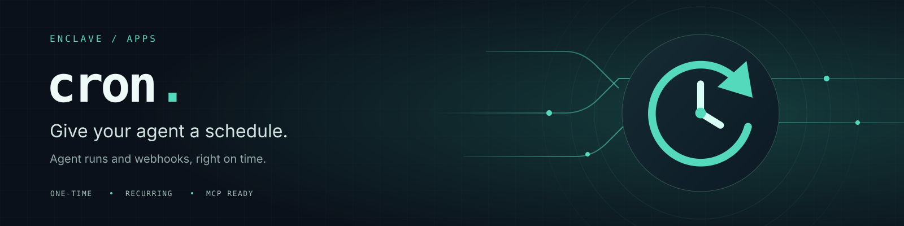

# Enclave Cron



A durable scheduler for Eyesoff-AI agent turns and configured HTTP callbacks.
It runs as an Enclave `wasm32-wasip2` **service app**, keeps its own clock loop,
and needs no open browser, external cron, or periodic HTTP tick.

An agent can create, inspect, pause, edit, delete, and explicitly run jobs
through MCP or a JSON API. One-time jobs use an RFC3339 timestamp with an
offset; intervals use seconds and an anchor; five-field numeric cron uses
**UTC**. The included web console manages the same jobs and results.

**Missed jobs are skipped.** After recovery, an expired one-time job is marked
skipped. A recurring job resumes at its next future occurrence, without
replaying the backlog. While running, the scheduler allows 30 seconds of
ordinary dispatch jitter; an occurrence that cannot get a slot in that time
is skipped too. One job never overlaps itself.

## Eyesoff integration

1. Configure a durable S3-compatible bucket supporting conditional `PutObject`
   (`If-Match` and `If-None-Match: *`). Use a dedicated state object such as
   `cron/state`, and credentials restricted to that object/prefix.
2. Copy [the deployment template](assets/deploy-config.template.json), replace
   the endpoint, bucket and account ID, and supply the referenced secrets.
   Both `CRON_API_KEY` and `CRON_MASTER_KEY` require at least 32 random characters.
3. Obtain the user's **personal Eyesoff API key** from Eyesoff's API dialog or
   authenticated `POST /v1/keys`. Store it as `EYESOFF_PERSONAL_API_KEY` in this
   scheduler's deployment secrets. Associate it with that user's canonical
   `acct_…` or lowercase wallet ID in `targets.eyesoff.api_keys`. Do not use a
   shared deployment/admin key: a scheduled turn must run as its own user.
4. Merge [the MCP entry](assets/eyesoff-tools.template.json) into Eyesoff's
   existing `tools.mcp` list, retaining all existing tools. Set the same
   `CRON_API_KEY` secret on Eyesoff and replace the scheduler address. `$user`
   comes from Eyesoff's verified caller identity, never from the model.
5. Ask the agent to list its schedule targets and create a job. It should
   return the persisted job ID and exact next due time. A promise in a chat
   without a successful `schedule_create` result is not a scheduled job.

The current Eyesoff build already supports this MCP/identity interface; this
integration needs configuration, **not an Eyesoff code release**. A per-user
callback credential is provisioned once. Short-lived SSO tokens are never
saved to authorize a future turn.

A scheduled Eyesoff run is a **new agent turn** with its stored prompt. It
can use that deployment's configured tools and the user's notebook identity.
It does not silently copy or resume browser-only chat history. Include the
required context or notebook references in the prompt. Results are stored in
the scheduler and exposed by `schedule_get`; there is no browser push, email,
or chat insertion unless you explicitly configure a separate delivery tool.
Prompts may ask the agent to save its output to its notebook.

Example tool arguments (choose a future date):

```json
{
  "name": "Weekday briefing",
  "client_key": "weekday-briefing-v1",
  "schedule": { "kind": "cron", "expression": "0 16 * * 1-5" },
  "action": {
    "kind": "eyesoff",
    "target": "eyesoff",
    "prompt": "Read my briefing preferences from my notebook. Research today's changes and save a short dated briefing to my notebook."
  }
}
```

16:00 UTC is 09:00 in Arizona. This first version has no IANA timezone/DST
scheduler; use an explicit offset for one-time runs and UTC for cron.
Supported cron fields: minute, hour, day of month, month, weekday (0/7 Sunday).
Numeric lists, ranges and steps work. Restricted day-of-month and weekday
use conventional cron OR semantics. Names, seconds, `L`, `W` and `#` do not.

For an interval: `{"kind":"interval","seconds":3600,"start_at":"2026-10-01T16:00:00Z"}`.
For once: `{"kind":"once","at":"2026-10-01T09:00:00-07:00"}`.

## Webhooks and allowed targets

Targets are deployment configuration, not model-selected URLs or headers:

```json
{
  "kind": "http",
  "url": "https://example.com/hooks/briefing",
  "method": "POST",
  "headers": { "x-api-key": "$WEBHOOK_KEY" },
  "users": ["acct_your_actual_account_id"],
  "timeout_s": 30
}
```

Add that under `targets.briefing_hook`. Jobs choose
`{"kind":"http","target":"briefing_hook","body":{"event":"briefing"}}`.
Users cannot change the target URL, method, credentials or timeout. HTTP
`users: ["*"]` explicitly shares that capability with every authenticated
scheduler user; Eyesoff targets always require individual credentials.
Redirects are not followed. HTTPS certificate and hostname verification stay
on. Loopback HTTP is permitted only with explicit `local_test: true`, for the
test harness. Egress uses the same per-deployment socket/SOCKS path as RISC Box.
No new host runtime or raw GPU capability is needed.

## API and identity

Except `/` and `/ping`, routes require either:

- `X-Api-Key: <scheduler service key>` plus `X-User: <canonical account ID>`;
  only this trusted-service credential may assert an arbitrary identity, or
- `X-Sso-Token` verified against an optional `sso` configuration (same format
  as Jot/API MCP Adapter, including accepted audience IDs).

The web console currently uses the service-key path and is intended for the
operator, not distribution of the master service key to end users. End-user
agents use the trusted Eyesoff connection. No credentials enter localStorage.
Every job and result lookup is scoped to the authenticated identity. Another
user's ID returns the same not-found result as a nonexistent ID.

`POST /mcp`: stateless Streamable HTTP, JSON responses, protocol 2025-06-18.
`GET /mcp` returns 405; there is no server-initiated SSE stream. Requests with
an `Origin` header are rejected on MCP; server-to-server clients omit it.
The management UI calls same-origin JSON endpoints instead.

`GET /api/tools`: schemas plus the Eyesoff MCP entry. `GET /api/runs`: recent
results for this user. `POST /api/<name>` accepts the same arguments as MCP:

| Tool | Purpose |
| --- | --- |
| `schedule_targets` | List this user's configured callbacks and time rules |
| `schedule_create` | Persist a job; repeated identical `client_key` is idempotent |
| `schedule_list` | List owned jobs and current UTC time |
| `schedule_get` | Read a job and recent results by `id` |
| `schedule_update` | Change `spec` and/or `enabled`, with expected `generation` |
| `schedule_delete` | Delete a job that has no active run |
| `schedule_run_now` | Explicit immediate run with an idempotent `request_key` |

Pausing prevents future occurrences; it does not cancel an already delivered
request. HTTP delivery cannot undo effects that the callback already performed.

## Durability and delivery semantics

All state is an AES-256-GCM encrypted object with a fresh random nonce and the
object key as authenticated data. A deployment-secret-derived key protects
prompts and results from the bucket. The service key and callback credentials
are never serialized into this state. Whoever controls the deployment master
secret can decrypt it; this is not protection from that secret's holder.

A 120-second lease, renewed every 30 seconds, and ETag compare-and-swap writes
fence concurrent scheduler instances. Mutations and a run's `running` record
are committed **before** acknowledgement or outbound effects. Missing ETags,
CAS conflicts, invalid ciphertext, and failed/ambiguous writes stop execution.
A replacement starts only after the lease expires. No partial/missing storage
response is interpreted as an empty database except an explicit 404.

This is **not exactly-once delivery**. A crash or timeout after an endpoint
accepts a request has an unknown outcome. Interrupted runs are recorded as
such and never automatically retried; failures likewise require an explicit
new run. The scheduler sends a stable per-run `Idempotency-Key`,
`X-Enclave-Job` and `X-Enclave-Run`. Receivers must honor the idempotency key if
they need effect deduplication. Eyesoff does not currently promise request
idempotency. `run_now` deduplication lasts while that run is retained; use a new
request key only for an intentional new execution.

Missed backlog is summarized by one skipped record, not thousands of rows.
The scheduler trusts the platform clock and storage's conditional-write
semantics. Encrypted storage is not a rollback-proof ledger: a malicious
storage operator restoring an old valid snapshot is outside this guarantee.

Limits: 128 jobs total, 32 per user; 16 KiB/action; 1–4 concurrent runs (default
1); 32 recent runs per user, 256 total, pruned further near the state size cap;
8 KiB/result retained; 512 KiB/callback response; 15-minute maximum run. A
stream that exceeds its cap or lacks Eyesoff's final `done` event fails.
Long callbacks are polled without blocking the API; short storage commits and
connection setup are synchronous. No GPUs or model weights are loaded here.

## Build and verify

```sh
cargo test --manifest-path cron/Cargo.toml
cargo build --release --target wasm32-wasip2 --manifest-path cron/Cargo.toml
python3 cron/tests/e2e.py
```

The Python harness requires `cryptography`. It uses a local synthetic S3/CAS
server and fake Eyesoff endpoint, launches the **real Wasm component**, checks
its encrypted persistence, signing, autonomous callback, tenant boundaries,
MCP calls, duplicate suppression, missed-run recovery, and fail-closed writes.
`--https-check` additionally makes one public GET to `https://eyesoff.ai/ping`
to verify the component's certificate-validating TLS path. It sends no prompt,
credential or model request there. Native debugging: `cargo build
--manifest-path cron/Cargo.toml` then `python3 cron/tests/e2e.py --native`.

Local launch:

```sh
ENCLAVE_CONFIG="$(cat my-private-config.json)" ENCLAVE_PORTS=http:8000=8000 \
  wasmtime run -S inherit-network=y -S allow-ip-name-lookup=y \
  --env ENCLAVE_CONFIG --env ENCLAVE_PORTS \
  cron/target/wasm32-wasip2/release/enclave-cron.wasm
```

Publish as a CPU service with port `http:8000`, transparent egress, and at least
128 MiB app memory. Port `8080` is reserved for platform infrastructure; do not
add it to the firewall. Cron binds the actual HTTP port provided through
`ENCLAVE_PORTS`, so the existing binary also works with `http:8000`. Use the
platform's normal catalog approval and owner-signed deployment flow. The template intentionally contains placeholders, not live
credentials. Publishing the build alone does not connect Eyesoff: provision
the secrets, storage, personal callback identity and MCP config above.

## Catalog artwork

- [Logo SVG](assets/logo.svg): transparent, scalable 96 × 96 view box.
- [Logo PNG](assets/logo.png): transparent 512 × 512 export.
- [Banner SVG](assets/banner.svg): editable 1600 × 400 catalog artwork.
- [Banner PNG](assets/banner.png): 1600 × 400 export.

The mint clock-and-arrow mark and navy timeline follow the catalog's existing
SVG format. Sources are hand-authored vectors, with no external image or font
dependencies. To regenerate PNG exports with librsvg:

```sh
rsvg-convert -w 512 -h 512 -o cron/assets/logo.png cron/assets/logo.svg
rsvg-convert -w 1600 -h 400 -o cron/assets/banner.png cron/assets/banner.svg
```
