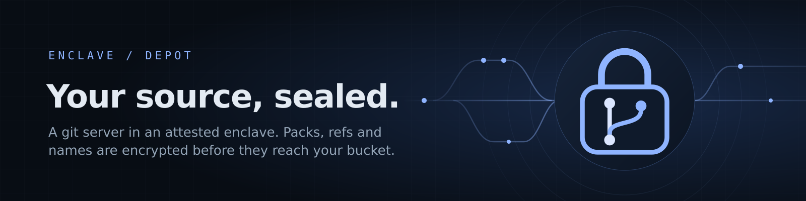

# Depot



A private git server that runs in an attested enclave and keeps everything in
your own S3-compatible bucket (Cloudflare R2 is the target), encrypted before
it leaves the enclave. Packs, indexes, refs, repository names and tokens are
ciphertext at rest; the bucket's operator sees object sizes and counts, never
code, branch names or history.

Plain `git` talks to it over smart HTTP: clone, fetch, push, shallow clones,
tags, thin packs, atomic pushes. A web view browses repositories, files and
history, and an admin page mints access tokens.

It is a `wasm32-wasip2` **service app** (one long-lived process, the shape of
cron and s3-ipfs-adapter): the git object model, pack codec, delta engine,
both upload-pack protocols, receive-pack, the HTTP server, the S3 client and
the storage format are hand-written Rust on `std`, with the TLS stack, hashes,
zlib and the AEAD as the only dependencies.

## What it speaks

| | |
| --- | --- |
| Fetch | protocol v2 (`ls-refs`, `fetch`) and v0/v1 stateless RPC with `multi_ack_detailed` + `no-done`, for clients that speak only v0 (libgit2, so cargo's git dependencies: verified) |
| Negotiation | full have/ACK/ready, so an incremental fetch sends only what is new; thin packs; `include-tag`; `ofs-delta` |
| Shallow | `--depth`, `--deepen`, `--unshallow`, `--shallow-since`, `--shallow-exclude` |
| Push | `report-status`, `side-band-64k` progress, `atomic`, `delete-refs`, `quiet`, `push-options` (accepted, ignored) |
| Checks on push | pack checksum, SHA-1 with collision detection (SHAttered-style objects refused), full connectivity with type checks, branch tips are commits, protected refs only fast-forward and are never deleted, every command's old value re-checked when it commits |
| Not supported | partial-clone filters (`--filter`), Git LFS, SHA-256 repositories, signed pushes, the dumb HTTP protocol |

Measured on the platform's wasm build against a local MinIO: the full
enclave.host repository (73,784 objects, 420 MiB, 2,033 refs) is indexed and
stored in 6.8 s and served to a mirror clone in 4.7 s; `git fsck --full`
is clean on both sides. Behind the platform, R2 bandwidth through egress is
the limit, not the server.

## Using it

**Authentication.** The Enclave app gateway removes the `Authorization`
header before a request reaches any app (it carries the owner's platform
session), so git's usual Basic credentials never arrive. Send the token as
`X-Api-Key` instead:

```sh
# one clone
git -c http.extraHeader="X-Api-Key: $DEPOT_TOKEN" clone https://git.example.com/enclave.git

# or once, for everything on this server
git config --global http.https://git.example.com/.extraHeader "X-Api-Key: $DEPOT_TOKEN"
git clone https://git.example.com/enclave.git
```

Basic auth (the token as the password), `Authorization: Bearer` and
`X-Depot-Token` also work wherever the header survives (locally, or behind
your own proxy). Public repositories need no token to clone or browse.

**Repositories** are created by their first push (by anyone allowed to write
that name), or by an admin in the web view. Names are one or two path
segments (`enclave`, `team/tool`); the URL is `https://<host>/<name>.git`.

**Tokens.** An admin mints tokens in the web view (*Access tokens*) or with
`POST /api/tokens {"user","read":[patterns],"write":[patterns],"admin",
"note","expires_days"}`. The token (`dpt_…`) is shown once; only its SHA-256
is stored, sealed in the bucket. Revoke with `DELETE /api/tokens?id=…`;
revocation is immediate. Users listed in the app config work alongside.

**Patterns** in `read`, `write` and `public` are globs where `*` matches
anything, `/` included: `*`, `enclave`, `team/*`.

**Webhooks.** After a push commits, each hook whose `repos` patterns match
receives `POST {event:"push", repository, pusher, time, updates:[{ref,
before, after}]}`, signed `X-Depot-Signature: sha256=<HMAC-SHA256(secret,
body)>`. The same value is sent as `X-Hub-Signature-256`, so receivers written
for GitHub verify it unchanged. Deliveries retry with backoff and never slow a
push.

**Mirroring** an existing repository, from GitHub or any URL:

```sh
DEPOT_TOKEN=dpt_… scripts/mirror.sh https://github.com/you/repo.git https://git.example.com/repo.git
```

It moves branches and tags only. A repository larger than the push limit goes
up in slices of its default branch's history. Re-running it sends only what
is new. During a transition, `git remote set-url --add --push origin
<depot-url>` makes every `git push origin` update both servers.

## Deploying on enclave.host

1. **Bucket.** Create an R2 bucket (for example `enclave-depot`) and an R2 API
   token with *Object Read & Write* on that bucket only. Note the account's S3
   endpoint, `https://<account-id>.r2.cloudflarestorage.com`. Depot needs R2's
   conditional writes (`If-Match`, `If-None-Match`), which it has.
2. **Secrets.** Generate the master key and an admin token, and **save the
   master key somewhere outside the platform first**. It is the only key to
   everything in the bucket: lose it and the data is unreadable; nothing can
   recover it.
   ```sh
   scripts/new-secrets.sh depot-secrets.env   # asks for the R2 key pair, writes all four (0600)
   ```
3. **Publish** the build (`target/wasm32-wasip2/release/depot.wasm`) as a CPU
   service app: slug `depot`, port `http:8000`, memory 2048 MiB (a push is
   held in memory while it is indexed; see *Memory* below),
   no GPU, with [`assets/deploy-config.template.json`](assets/deploy-config.template.json)
   as the version config (fill in the endpoint and bucket; every `$NAME` is a
   secret, so the public config holds none). With the CLI:
   ```sh
   enclave publish target/wasm32-wasip2/release/depot.wasm --slug depot --version 0.1.0 \
     --name Depot --desc "Private git server, encrypted at rest in your bucket" \
     --mem 2048 --cpu-gflops 20 --ports http:8000 --config "$(cat my-depot-config.json)"
   ```
4. **Deploy** it **public** (the platform only routes public deployments; the
   app enforces access itself), with transparent egress, and the four
   secrets (`DEPOT_R2_ACCESS_KEY`, `DEPOT_R2_SECRET_KEY`, `DEPOT_MASTER_KEY`,
   `DEPOT_ADMIN_TOKEN`) staged before first boot:
   ```sh
   enclave deploy depot --public --fund 10 --secrets-file depot-secrets.env
   ```
5. **Check** `https://<label>.app.enclave.host/` (or attach a custom domain
   such as `git.enclave.host`), use the admin token in *Access token*, mint
   personal and CI tokens, then push.

The server refuses to start if the bucket is unreachable or the master key
cannot open what is already there, so a wrong key never writes anything.
`DEPOT_PROBE=https://<endpoint>` makes one GET over the build's own TLS and
egress path and exits, which diagnoses a bucket that cannot be reached.

## Configuration

`ENCLAVE_CONFIG` (JSON; the platform also delivers it as the file named by
`ENCLAVE_CONFIG_FILE`, which is read first). Values written `$NAME` are
deployment secrets: the platform substitutes them before the app starts, and
a reference left unsubstituted is read from the environment.

| Key | Default | |
| --- | --- | --- |
| `storage.endpoint` | required | `https://` origin of the S3 API (R2: `https://<account>.r2.cloudflarestorage.com`) |
| `storage.region` | `auto` | SigV4 region (`auto` for R2) |
| `storage.bucket` | required | |
| `storage.prefix` | `""` | key prefix inside the bucket, e.g. `depot/` |
| `storage.access_key`, `storage.secret_key` | required | `$SECRET` references |
| `master_key` | required | `$SECRET`, at least 32 characters |
| `users` | `{}` | `name: {token: "$SECRET" \| token_sha256: "<hex>", admin, read: [...], write: [...], account}` |
| `public` | `[]` | repository patterns anyone may clone and browse (also settable per repository) |
| `protected` | `[]` | ref patterns that only fast-forward and cannot be deleted, e.g. `refs/heads/main`, `refs/tags/v*` |
| `default_branch` | `main` | HEAD of a new repository |
| `max_push_mb` | 1024, or less on a smaller guest | largest pack one push may send (held in memory while indexed); defaults to what fits under `ENCLAVE_MEM_MB` |
| `max_object_mb` | 512 | largest single object |
| `cache_mb` | 256, or an eighth of a smaller guest | decrypted pack chunks kept in memory; resolved objects get a quarter of that |
| `hooks` | `[]` | `{url, secret: "$SECRET", repos: [patterns]}` (https; up to 16) |
| `sso` | none | Sign in with Enclave for the web view: `{signer, audience: <this deployment's id>}`; a user with a matching `account` (`acct_…` or a wallet address) signs in as that user |
| `title` | `depot` | the web view's title |

## Storage format and what it protects

```text
<prefix>registry             sealed: repository name -> random id, settings
<prefix>tokens               sealed: minted tokens (SHA-256 hashes) and their permissions
<prefix>r/<id>/manifest      sealed: HEAD, refs, the pack list (rewritten with compare-and-swap)
<prefix>r/<id>/<pack>.pack   a git pack, sealed in 256 KiB chunks
<prefix>r/<id>/<pack>.idx    sealed: that pack's object index and the commit/tree graph
```

- **Encryption.** ChaCha20-Poly1305 under keys derived from the master key
  (HMAC-SHA256). Small objects are sealed whole, with a random nonce and the
  object key as associated data. Packs are sealed in 256 KiB chunks so a
  fetch can read the range it needs. Each pack has its own key. A chunk's
  associated data binds the object key, the pack's length, the chunk size and
  the chunk's position, so chunks cannot be swapped, truncated or moved.
- **Names.** Object keys carry only random ids. Repository names, refs and
  token metadata are inside sealed objects.
- **Consistency.** Packs are immutable. Only the registry, the token book and
  the manifests are ever rewritten, always conditionally on the ETag the
  writer read. Two servers
  sharing a bucket cannot lose each other's pushes, and each sees the other's
  within two seconds.
- **Integrity, not freshness.** Authentication detects any alteration. A
  storage operator replaying an *older* valid manifest is caught only while
  the server remembers a newer revision (within one process lifetime).
- **Who can read it.** Whoever holds the master key. On enclave.host that is
  the deployment's secret store (operator-readable by design; see the
  platform's secrets documentation) and the running enclave. The bucket
  provider cannot read it.
- **No lock-in.** [`scripts/depot-export.py`](scripts/depot-export.py) needs
  only the bucket credentials and the master key. It decrypts every
  repository into ordinary bare git repositories, verified with `git
  index-pack` and `git fsck`. The stored packs are valid git packs.

## Operations

- **Repack.** Every push stores one pack. A geometric repack (factor 2)
  merges the newest packs whenever one would be less than twice the size of
  all newer ones, so the pack count stays logarithmic. Merging copies entries
  byte for byte, streamed storage to storage while the server is idle. The
  packs it replaced are deleted an hour later, after any fetch planned
  against them has finished. An admin can trigger it from a repository's
  settings or with `POST /api/maintenance?repo=`.
- **Orphans.** A push or repack that dies after uploading but before
  committing leaves a pack that no manifest lists. A daily sweep deletes such
  objects once they are a day old, which is far longer than any upload in
  flight.
- **Status.** `GET /api/status` (admin) reports loaded repositories, cache hit
  rates, storage calls and bytes, traffic, maintenance and webhooks.
- **Memory.** Each repository's object index and graph stay in memory (the
  enclave repository, 73,784 objects: about 65 MB). A push holds its pack in
  8 MiB segments plus a delta-resolution cache of up to 256 MiB while it is
  indexed (measured: a 420 MiB push peaks at 719 MiB for the whole process).
  Pushes in flight share one budget of `max_push_mb`, so two large pushes at
  once refuse rather than exhaust the guest. Fetches stream: a clone holds one
  8 MiB window at a time plus the shared chunk cache. Size the deployment at
  `max_push_mb` + 1 GiB (2048 MiB for the default 1024).
- **Restarts** reload everything from the bucket. Nothing lives only on the
  enclave.
- **Deleting a repository** (admin, `DELETE /api/repo?repo=&confirm=<name>`)
  removes it from the registry, then deletes its objects.

## Build and test

```sh
cargo test                                            # unit tests (native)
cargo build --release --target wasm32-wasip2          # target/wasm32-wasip2/release/depot.wasm
python3 tests/e2e.py                                  # real git + wasmtime + MinIO, 43 checks
python3 tests/e2e.py --platform                       # through a Node gateway like the platform's, storage via a SOCKS5 egress front
python3 tests/e2e.py --mirror ~/src/big-repo          # also mirror a real repository and clone it back
python3 tests/fuzz.py --rounds 800 --seed 2           # malformed requests at every endpoint; the server must survive
python3 tests/dev.py                                  # a local server with sample repositories, to look at
```

The end-to-end suite needs `git`, `wasmtime`, `minio`, `curl`, `node` and
Python's `cryptography`. It covers both protocol versions; thin, shallow,
deepen and unshallow fetches; protected refs and atomic pushes; a 24 MiB blob
through multipart upload; concurrent clones and contended pushes; minted
tokens over `X-Api-Key`; cargo's libgit2 cloning and updating a git
dependency; repack, the retired-pack and orphan sweeps; restart from the
bucket; export to plain git; and a scan of every stored byte for plaintext.
The scan has a control that must find a planted plaintext object.

## Catalog artwork

[Logo](assets/logo.svg) (96 × 96 view box, [PNG](assets/logo.png) at 512) and
[banner](assets/banner.svg) (1600 × 400, [PNG](assets/banner.png)),
hand-authored vectors in the suite's style. Regenerate the PNGs with
`rsvg-convert -w 512 -h 512 -o assets/logo.png assets/logo.svg` and
`rsvg-convert -w 1600 -h 400 -o assets/banner.png assets/banner.svg`.
